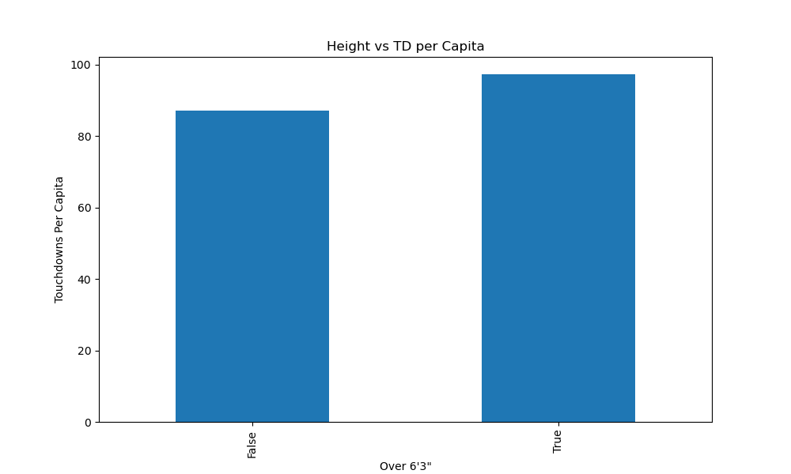
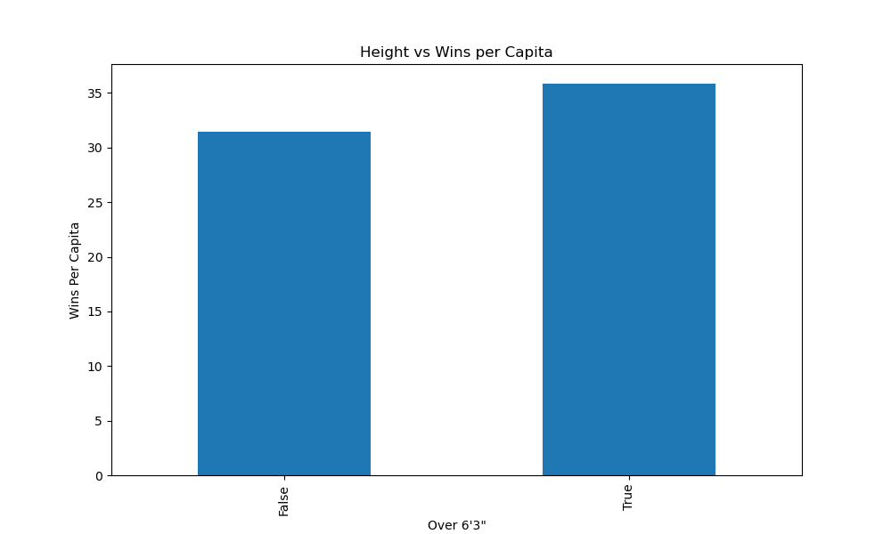
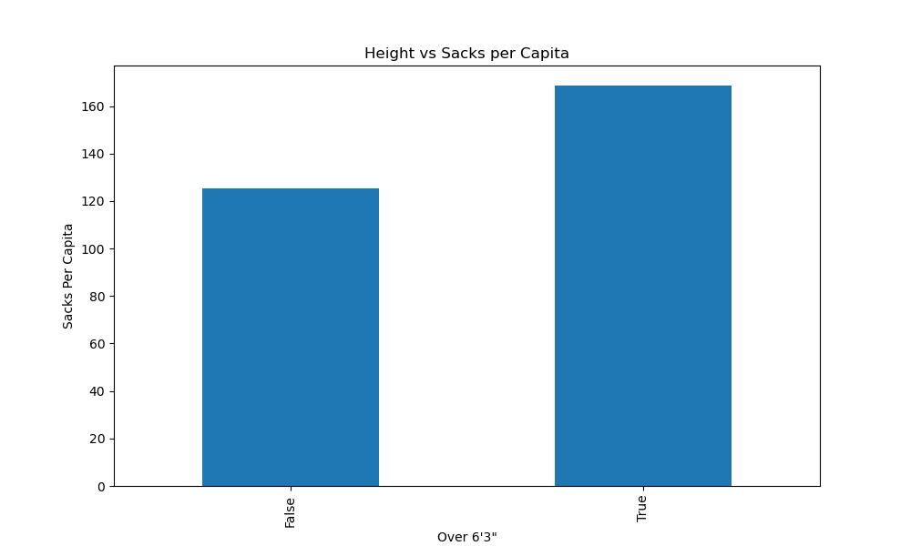
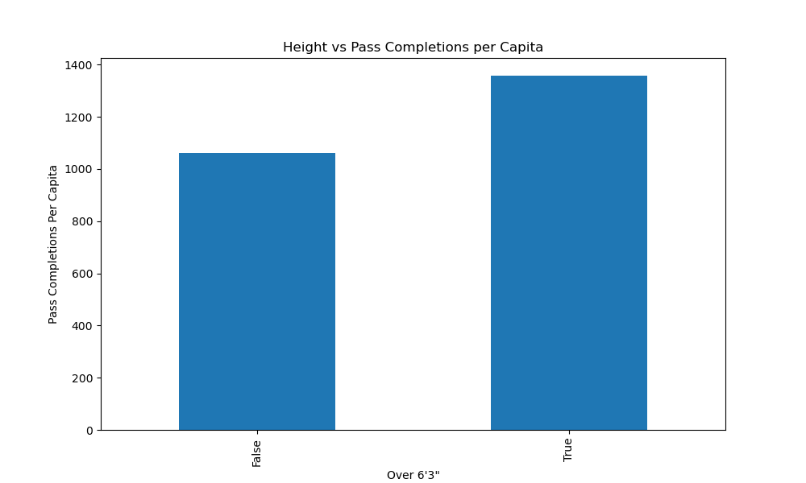
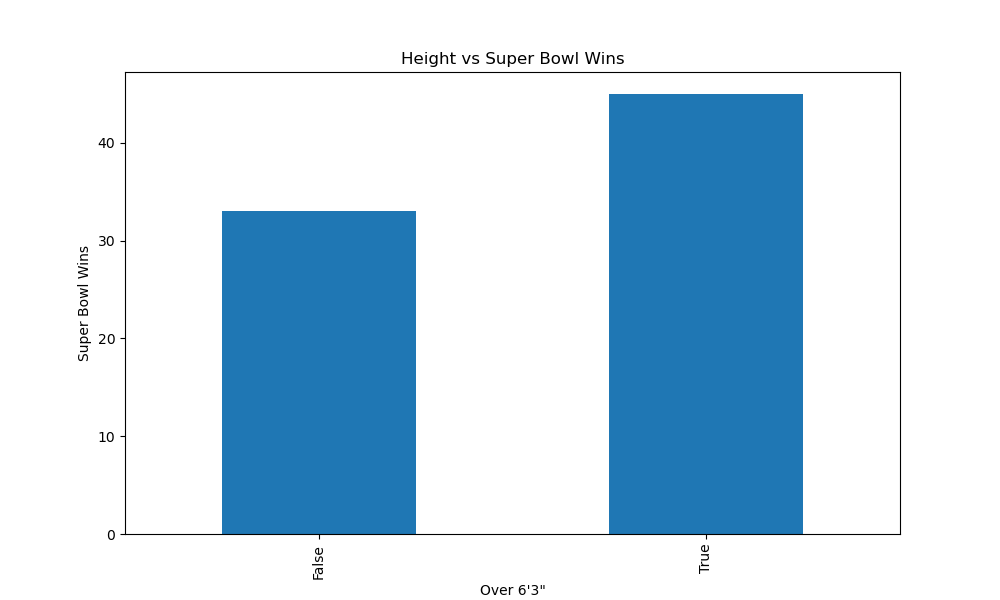

# Does Height affect NFL Quarterback's preformance?

Analysis of height versus different factors, data from quarterbacks 1920, excluding quarterbacks that did not start 6 or more games in the regular season.

Data was taken from [Stathead](https://stathead.com/football/player-season-finder.cgi?request=1&match=player_season_combined&order_by=height&year_min=2010&year_max=2023&positions%5B%5D=qb&ccomp%5B1%5D=gt&cval%5B1%5D=6&cstat%5B1%5D=games_started&ccomp%5B2%5D=gt&cval%5B2%5D=0&cstat%5B2%5D=pass_cmp&ccomp%5B3%5D=gt&cval%5B3%5D=0&cstat%5B3%5D=pass_att&height_min=60)

A glossery can be found [here](https://github.com/mrotblut/QB-Height/blob/main/full_glossery.txt)
The data is filtered for Quarterbacks that have started 12 or more games in the regular season from 1920 to present. The breakdown of the dataset by height is below.

|Height|Count|
|------|-------|
|5-5|1|
|5-6|1|
|5-7|1|
|5-8|2|
|5-9|1|
|5-10|7|
|5-11|14|
|6-0|26|
|6-1|70|
|6-2|86|
|6-3|90|
|6-4|77|
|6-5|38|
|6-6|10|
|6-7|2|

As there is not sufficent data for shorter quarterbacks the data is split into two categories, whether or not the quarter back is 6'3" or taller.

|Tall|Count|
|---|---|
|False|209|
|True|217|

I did an analysis of different metrics which would give an idea of preformance. All data analysis is done per capita in order to accuratly use the data.

### Passing Touchdowns

The first analysis is the amount of touchdowns per capita by the QB's.

|Tall|TD|
|----|----|
|False|87.22|
|True|97.28|

### Pick 6

Another analysis done was on Pick 6's. The data from Pick 6's starts in 1950.

|Tall|Pick6|
|----|----|
|False|5.25|
|True|6.47|

### Yards Per Game Played

Using Yards per game played is more relevant than total yards as the QB's have played different amounts of games.

|Tall|YPG|
|----|----|
|False|129.93|
|True|157.89|

### Wins

The amount of wins each quarterback has when they have started a game.

|Tall|Wins|
|----|----|
|False|31.46|
|True|35.85|

### Sacks

The amount of sacks each quarterback has in a game they started.

|Tall|Sacks|
|----|----|
|False|125.14|
|True|168.64|

### Pass Completions 

The amount of completions each quarterback has in a game they started.

|Tall|Completions|
|----|----|
|False|1061.28|
|True|1357.79|

### Superbowl Wins

How many superbowls have been won by Quarterbacks that were 6'3" or taller, includes any QB that has played in the game since 1971

[source](https://stathead.com/football/player-game-finder.cgi?request=1&order_by=name_display_csk&timeframe=seasons&comp_type=post&phase_id=superbowl&height_min=60&season_positions%5B%5D=qb)

|Tall|Superbowl Wins|
|----|----|
|False|33| 
|True|45|

## Conclusion 

Taking into account that Quarterbacks don't operate in a bubble and their preformance depends on the rest of the team, in almost all of the metrics taller QB's had a better preforance. In only Pick 6's and Sacks did taller QB's get beat by shorter ones. For Pick 6's there is only a difference of one Pick 6 per capita and for Sacks there is a bigger difference. Taller QB still pull through on the most important game, winning the Superbowl. 